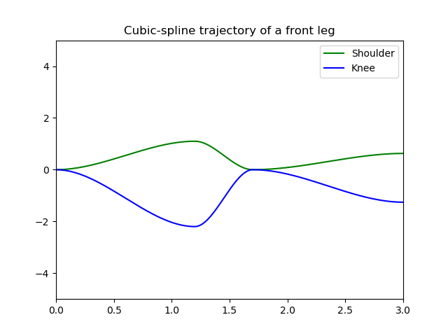

# solo-pybullet

**Simulation and Controller code for Solo Quadruped**

This repository offers an environment to simulate different controllers on the Quadruped robot **Solo**.

You can implement your controller on the *controller.py* file and call your control function in the main program *main.py* by replacing the `c(...)` function in the loop.

## Installation

Install [Pinocchio](https://github.com/stack-of-tasks/pinocchio/) following the procedure described [here](https://stack-of-tasks.github.io/pinocchio/download.html)

Install [Gepetto Viewer](https://github.com/gepetto/gepetto-viewer-corba) following the procedure described [here](https://github.com/gepetto/gepetto-viewer-corba#setup-from-robotpkg-apt-binary-package-repository)

Then, install PyBullet using pip 3:
`pip3 install --user pybullet`

## How to start the simulation
Launch `gepetto-gui`, then `python3 -m solo_pybullet`

## A first smooth jump trajectory

The jump controller is currently based on cubic splines. The trajectory is parametrized by the time of the three phases of the jump: crouching, jumping and reaching reception position.  

## To do

Optimal trajectory and gains wrt the jump we want
